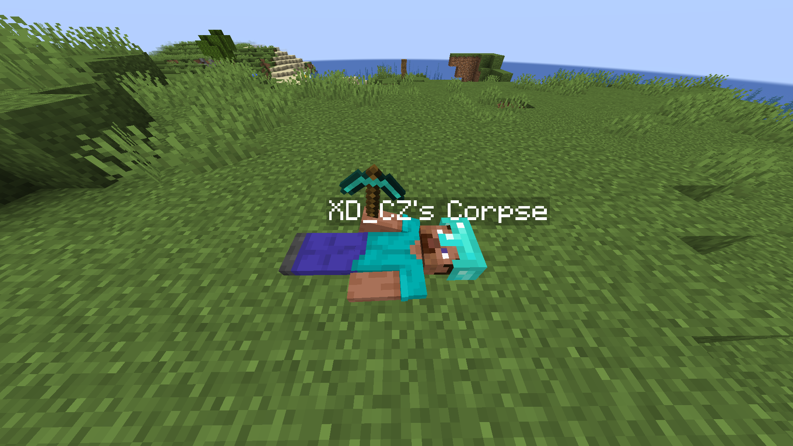
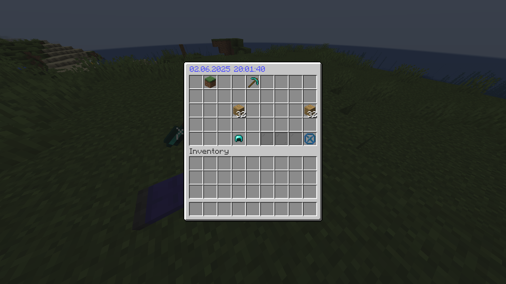

# Mrthvolium

Mrthvolium is a server-side plugin that adds corpses to the game. When a player dies, a corpse
spawns at their death location, storing their items and experience.




## Supported platforms

- [Paper 1.21.8](https://papermc.io)
- [Purpur 1.21.8](https://purpurmc.org)
- ❌ Not compatible with Bukkit
- ❌ Not compatible with Spigot

## Features

- Corpses appear on player death, storing the player's inventory
- Corpse rotting system (configurable)
    - Corpse is not accessible to other players until it rots
    - After 30 minutes a corpse rots and everyone can loot it
    - After another 30 minutes the corpse despawns with all items
- Loot corpse button in the corpse inventory
- Highly customizable
    - Disable/enable corpse rotting, despawning, protection, loot button etc.
    - Rot and despawn timings
    - Rotten corpse skin
    - Display and inventory titles, messages
    - see [config.yml](src/main/resources/config.yml) for more

## How to

### Uninstall the plugin

Mrthvolium currently <ins>**CANNOT BE UNINSTALLED**</ins>.
> [!CAUTION]
> Removing the plugin jar from the plugins folder will cause corpses to stop working.
> Corpse nametags will remain visible in the world.  
> Placing the plugin jar back into the plugins folder will resolve this.

### Remove an existing Corpse

To manually remove a corpse from the world, stand as close as possible to the corpse and run:

```
/kill @n[nbt={BukkitValues:{"mrthvolium:is_corpse_main_part":true}},distance=..2]
```

### Bypass corpse protection

To loot corpses protected by player ownership

1. Install a permission plugin (e.g., [LuckPerms](https://luckperms.net/))
2. Grant yourself the `mrthvolium.bypass.protection` permission

Players with this permission can loot any corpse, regardless of ownership.  
Operators have this permission by default.

## Building

Requirements:

- [Git](https://git-scm.com/downloads)
- [Java 21](https://www.oracle.com/java/technologies/downloads/#java21)

```bash
git clone https://github.com/huzvanec/Mrthvolium.git
cd Mrthvolium
./gradlew build
```

The plugin jar is now located in `build/libs/`.